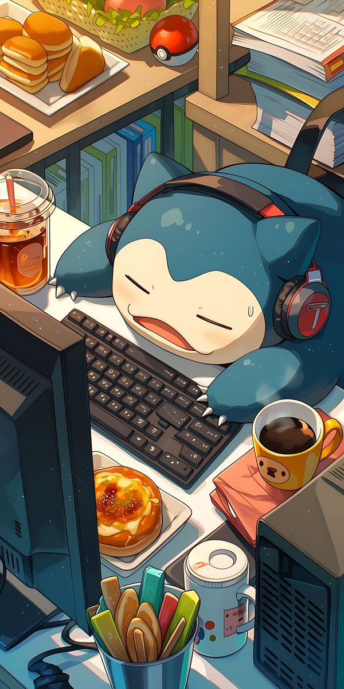

  <table>
    <tr>
      <td width="60%" valign="top">
        <h1>¡Hola! Soy Orianna ✨</h1>
        <h3>💻 Software Student & Web Development Explorer</h3>
        
Estudiante apasionada por la tecnología, la arquitectura de software y el diseño de interfaces. Me enfoco en crear experiencias web atractivas, funcionales y accesibles.

        <ul>
          <li>🎓 <b>Educación:</b> Tecnicatura Superior en Desarrollo de Software (IFTS 29)</li>
          <li>🎨 <b>Especialidad:</b> Maquetación web responsive, diseño UI/UX y lógica de software</li>
          <li>⚡ <b>Enfoque:</b> Código limpio, componentes reutilizables y atención al detalle visual</li>
        </ul>
         
        
<b>🛠️ Stack & Herramientas:</b>

        

          
          
          
          
          
        

         
        <h3>🎨 UI/UX & Web Design</h3>
        
<i>"El buen diseño es invisible; la buena experiencia se siente."</i>

        <ul>
          <li>📐 <b>Prototipado en Figma:</b> Creación de wireframes, sistemas de diseño y maquetación visual.</li>
          <li>🌐 <b>CMS & Custom Web:</b> Desarrollo y maquetación de sitios web flexibles e interactivos.</li>
        </ul>
      </td>
      <td width="40%" align="center" valign="middle">
        
      </td>
    </tr>
  </table>

  

  <h3>🚀 Proyectos & Enfoque Actual</h3>
  <ul>
    <li>🌌 <b>Astravia:</b> Creación e identidad visual para agencia digital (diseño minimalista, glassmorphism y web moderna).</li>
    <li>🌱 <b>Aprendiendo activamente:</b> JavaScript moderno, maquetación avanzada con CSS y sistemas de diseño en Figma.</li>
  </ul>

